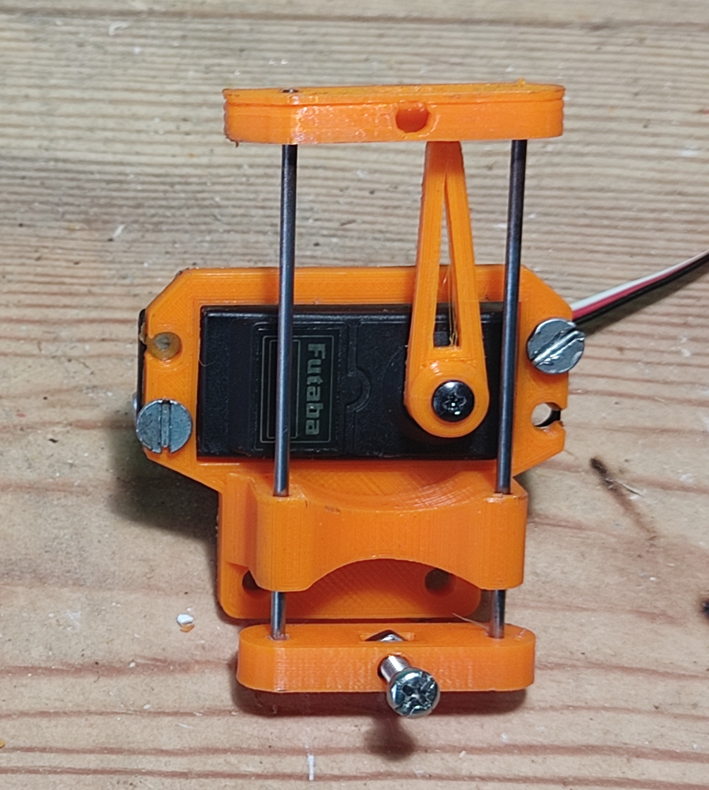

## AXI Draw by Arya Mitra

This is my attempt at creating an AXI Draw clone. Here I document my various version and iteration of the hardware and software.
# Electronics
Electronis consists of
1. Arduino Uno
1. CNC shield
1. Nema 17 (q2)
1. a4988 (stepper driver)
1. drv8825 (stepper driver)
1. 2n2222 (transistor)
1. s3004 (servo) 
1. LM7805 (12v to 5v voltage regulator)
1. MakerBot Limit switch (q2)
1. jhd162a (lcd)
1. PCF8574? (lcd I2C expander)

I am using a 12v 2amp power supply to power the cnc sheild 
and arduino as 12v is a voltage rating used by  `

# Hardware

## Version 1

## Pen holder mechanism

Tolerance for shafts were low as the shafts were 3d printed,
this caused the pen to rotate a large amount.

metal shafts were used with 0.15 tolerance used for the 
3d printed parts thus removing the large rotation.
but due to the overall design of the assembly the mechanism
would bind and cause the servo to stall. 
## Version 2

## Version 3

# Software

## Stepper

## Stepper

## Servo

## LCD

## Cartesian plane

## Prototype

## Tools

## Final
